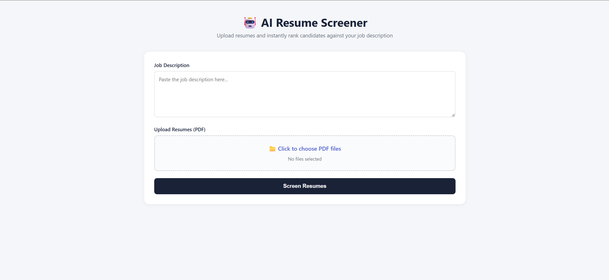

# 🤖 AI Resume Screener

An intelligent resume screening system that automatically ranks candidates based on how well their resumes match a job description.

Built with Python, FastAPI, and Machine Learning (TF-IDF + Cosine Similarity).

---

## 🎯 What It Does

- Upload multiple resumes (PDF format)
- Paste a job description
- AI ranks candidates by match score
- Shows matched and missing skills for each candidate
- Clean, professional dashboard UI

---

## 🖥️ Demo



---

## 🛠️ Tech Stack

| Layer | Technology |
|-------|-----------|
| Backend | Python, FastAPI |
| ML | TF-IDF, Cosine Similarity, scikit-learn |
| NLP | NLTK (tokenization, lemmatization, stopwords) |
| PDF Parsing | PyMuPDF |
| Frontend | HTML, CSS, JavaScript |

---

## 🚀 How to Run Locally

### 1. Clone the repository
```bash
git clone https://github.com/CreatewithShubh/ai-resume-screener.git
cd ai-resume-screener
```

### 2. Create and activate virtual environment
```bash
python -m venv venv
venv\Scripts\activate
```

### 3. Install dependencies
```bash
pip install fastapi uvicorn python-multipart PyMuPDF nltk scikit-learn pandas numpy spacy
```

### 4. Download NLTK data
```bash
python -c "import nltk; nltk.download('punkt'); nltk.download('stopwords'); nltk.download('wordnet'); nltk.download('punkt_tab')"
```

### 5. Run the backend
```bash
cd backend
uvicorn main:app --reload
```

### 6. Open the frontend
Open `frontend/index.html` in your browser.

---

## 📁 Project Structure
```bash
ai-resume-screener/
├── backend/
│   ├── main.py          # FastAPI server & routes
│   ├── parser.py        # PDF text extraction
│   ├── preprocessor.py  # Text cleaning & NLP
│   └── matcher.py       # TF-IDF scoring & skill matching
├── frontend/
│   └── index.html       # Dashboard UI
└── README.md
```

## 🧠 How the AI Works

1. **PDF Parsing** — Extracts raw text from uploaded PDF resumes
2. **Text Preprocessing** — Cleans text (lowercase, remove stopwords, lemmatize)
3. **TF-IDF Vectorization** — Converts text into numerical vectors
4. **Cosine Similarity** — Measures how similar each resume is to the job description
5. **Skill Matching** — Identifies matched and missing skills
6. **Ranking** — Sorts candidates from highest to lowest match score

---

## 👨‍💻 Author

**Shubham Kumar**
- GitHub: [@CreatewithShubh](https://github.com/CreatewithShubh)

---

## 📄 License

This project is open source and available under the [MIT License](LICENSE).