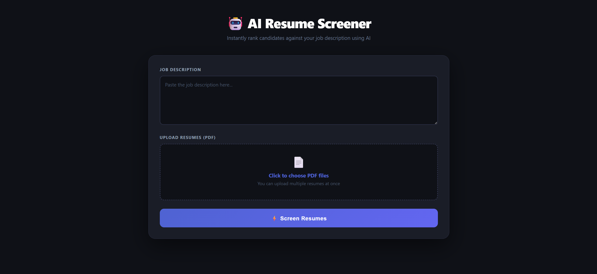

# 🤖 AI Resume Screener

An intelligent resume screening system that automatically ranks candidates based on how well their resumes match a job description using AI and Machine Learning.

🔗 **Live Demo:** [Click here to try it](https://createwithshubh.github.io/ai-resume-screener/frontend/)
⚙️ **API:** [https://ai-resume-screener-o0gp.onrender.com](https://ai-resume-screener-o0gp.onrender.com)

---

## 🎯 What It Does

- Upload multiple resumes (PDF format)
- Paste a job description
- AI ranks candidates by match score
- Shows matched and missing skills for each candidate
- Generates an AI summary for each resume
- Clean, professional dark mode dashboard UI

---

## 🖥️ Demo



---

## 🛠️ Tech Stack

| Layer | Technology |
|-------|-----------|
| Backend | Python, FastAPI |
| ML | TF-IDF, Cosine Similarity, scikit-learn |
| NLP | NLTK (tokenization, lemmatization, stopwords) |
| PDF Parsing | PyMuPDF |
| Summarization | Extractive Summarization (TF-IDF based) |
| Frontend | HTML, CSS, JavaScript |
| Deployment | Render (backend), GitHub Pages (frontend) |

---

## 🚀 How to Run Locally

### 1. Clone the repository
```bash
git clone https://github.com/CreatewithShubh/ai-resume-screener.git
cd ai-resume-screener
```

### 2. Create and activate virtual environment
```bash
python -m venv venv
venv\Scripts\activate
```

### 3. Install dependencies
```bash
pip install -r backend/requirements.txt
```

### 4. Download NLTK data
```bash
python -c "import nltk; nltk.download('punkt'); nltk.download('stopwords'); nltk.download('wordnet'); nltk.download('punkt_tab')"
```

### 5. Run the backend
```bash
cd backend
uvicorn main:app --reload
```

### 6. Open the frontend
Open `frontend/index.html` in your browser.

---

## 📁 Project Structure

```bash
ai-resume-screener/
├── backend/
│   ├── main.py           # FastAPI server & routes
│   ├── parser.py         # PDF text extraction
│   ├── preprocessor.py   # Text cleaning & NLP
│   ├── matcher.py        # TF-IDF scoring & skill matching
│   ├── summarizer.py     # AI resume summarization
│   └── requirements.txt  # Python dependencies
├── frontend/
│   └── index.html        # Dark mode dashboard UI
├── demo.png              # App screenshot
└── README.md
```

---

## 🧠 How the AI Works

1. **PDF Parsing** — Extracts raw text from uploaded PDF resumes
2. **Text Preprocessing** — Cleans text (lowercase, remove stopwords, lemmatize)
3. **TF-IDF Vectorization** — Converts text into numerical vectors
4. **Cosine Similarity** — Measures how similar each resume is to the job description
5. **Skill Matching** — Identifies matched and missing skills from a curated skill list
6. **Extractive Summarization** — Picks the most important sentences from each resume
7. **Ranking** — Sorts candidates from highest to lowest match score

---

## 👨‍💻 Author

**Shubham Kumar**
- GitHub: [@CreatewithShubh](https://github.com/CreatewithShubh)

---

## 📄 License

This project is open source and available under the [MIT License](LICENSE).